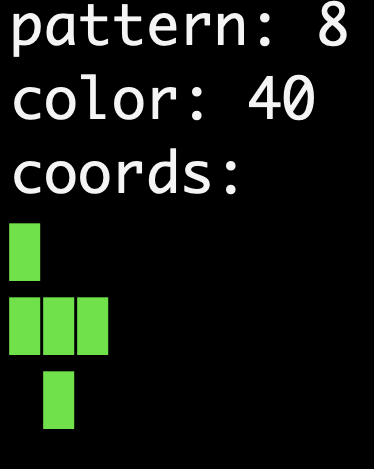
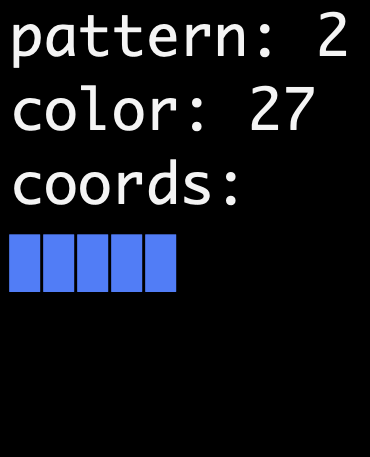
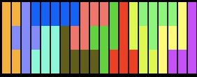

# Pentomino
ペントミノパズルを解くことができるプログラムです。  
ペントミノに関するヘッダファイルとしてまとまってます。  
pdfに結果などがまとめてあります。
### 構成内容
- board.h：盤面に関する機能を記述したヘッダ
- pentomino.h：ペントミノに関する機能を記述したヘッダ
### 実行方法
```
g++ pazzle.cpp -o pazzle -O2
./pazzle
```
---
### サンプル画像
<p align="left">

<br>

<br>
<em>ピースの表示</em>
<br>


<em>パズルが埋まった結果</em>
</p>
